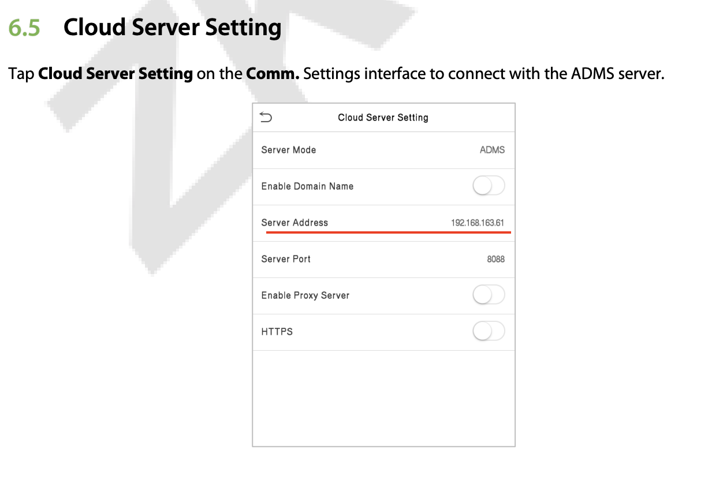
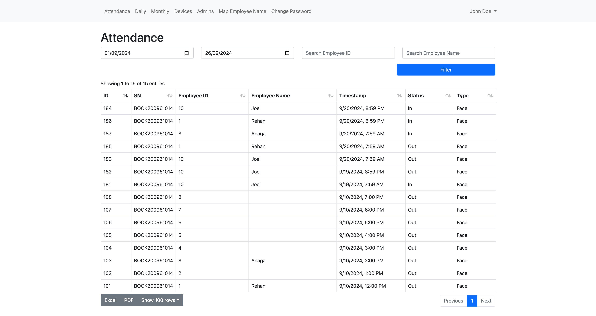

# Access (Attendance Device Management System)
A comprehensive README file that covers the steps to clone the project, deploy it on an Ubuntu server with Apache, and secure specific routes with .htaccess password protection:
Access is a comprehensive Attendance Device Management System designed to handle biometric and access control data from various devices. This system is built using Laravel, a PHP framework, and provides functionalities to store and manage user and fingerprint data.

## Table of Contents

1. [Introduction](#introduction)
2. [Prerequisites](#prerequisites)
3. [Setting up the Server](#setting-up-the-server)
    - [Installing PHP and Required Extensions](#installing-php-and-required-extensions)
    - [Installing Composer](#installing-composer)
    - [Installing Node](#install-node)
    - [Installing MySQL](#installing-mysql)
4. [Cloning the Repository](#cloning-the-repository)
5. [Installing Dependencies](#installing-dependencies)
6. [Configuring the Environment](#configuring-the-environment)
7. [Migrating the Database](#migrating-the-database)
8. [Serving the Application](#serving-the-application)
9. [Deploying to Production](#deploying-to-production)
    - [Installing Apache](#installing-apache)
    - [Configuring Apache for Laravel](#configuring-apache-for-laravel)
    - [Securing Specific Routes with .htaccess Password Protection](#securing-specific-routes-with-htaccess-password-protection)
    - [Routing Traffic through Port 8080 with Cloudflare](#routing-traffic-through-port-8080-with-cloudflare)
10. [Troubleshooting](#troubleshooting)

## Introduction


Device Manual: [https://catalogoarquitectura.s3.amazonaws.com/media/post_file/Manual-Usuario-Speedface-V5L_TD__91514166-f167-4838-a544-6d948fc6d224.pdf](https://catalogoarquitectura.s3.amazonaws.com/media/post_file/Manual-Usuario-Speedface-V5L_TD__91514166-f167-4838-a544-6d948fc6d224.pdf)
The Access system is designed to work with Zkteco SpeedFace-V5L-RFID devices, which send log data to the application through specific routes. These routes are:

-   `/iclock/cdata`
-   `/iclock/test`
-   `/iclock/getrequest`

You will need to provide server address to the Zkteco SpeedFace-V5L-RFID device.


But the issue is anyone on the same network can access these routes.
To ensure the security and integrity of the data, it is essential to protect these routes from unauthorized access. This is achieved by implementing .htaccess password protection.

## Prerequisites

Before you begin, ensure you have the following installed on your system:

-   Git
-   Apache
-   PHP
-   Node.js
-   MySQL

## Setting up the Server

### Installing PHP and Required Extensions

1. Update your package manager:

    ```
    sudo apt update
    ```

2. Install PHP and required extensions:

    ```
    sudo apt install php php-cli php-fpm php-json php-common php-mysql php-zip php-gd php-mbstring php-curl php-xml php-pear php-bcmath
    ```

3. Verify PHP installation:
    ```
    php -v
    ```

### Installing Composer

1. Download Composer:

    ```
    curl -sS https://getcomposer.org/installer | php
    ```

2. Move Composer to a global location:

    ```
    sudo mv composer.phar /usr/local/bin/composer
    ```

3. Verify Composer installation:
    ```
    composer --version
    ```

### Install Node
Install node via NVM (Node Version Manager)
Install NVM:

```bash
curl -o- https://raw.githubusercontent.com/nvm-sh/nvm/v0.39.3/install.sh | bash
```

Load NVM and install the latest LTS version of Node.js:

```bash
export NVM_DIR="$([ -z "${XDG_CONFIG_HOME-}" ] && printf %s "${HOME}/.nvm" || printf %s "${XDG_CONFIG_HOME}/nvm")"
[ -s "$NVM_DIR/nvm.sh" ] && \. "$NVM_DIR/nvm.sh"
source ~/.bashrc
nvm install --lts
nvm use --lts
nvm alias default 'lts/*'
```

### Installing MySQL

1. Install MySQL:

    ```
    sudo apt install mysql-server
    ```

2. Secure the MySQL installation:

    ```
    sudo mysql_secure_installation
    ```

    Follow the prompts to set a root password and configure other security settings.

3. Verify MySQL installation:

    ```
    mysql -u root -p
    ```

## Cloning the Repository

1. Open your terminal and navigate to the directory where you want to clone the project.
2. Clone the repository:

    ```bash
    git clone repo_url
    cd project_name
    ```

## Installing Dependencies

1. Install the required PHP dependencies using Composer:

    ```bash
    composer install
    ```

2. Install the required JavaScript dependencies using npm:

    ```bash
    npm install
    ```

## Configuring the Environment

1. Copy the `.env.example` file to `.env`:

    ```bash
    cp .env.example .env
    ```

2. Open the `.env` file and update the following environment variables:

    ```
    DB_CONNECTION=mysql
    DB_HOST=127.0.0.1
    DB_PORT=3306
    DB_DATABASE=adms
    DB_USERNAME=root
    DB_PASSWORD=your_mysql_password
    ```
3. Generate key

    ```bash
    php artisan key:generate
    ```

## Migrating the Database

1. Run the database migrations:

    ```bash
    php artisan migrate
    ```

## Serving the Application

1. Start the development server:

    ```bash
    php artisan serve
    ```

    The application should now be accessible at `http://localhost:8000`.

## Deploying to Production

### Installing Apache

1. Update the package manager:

    ```
    sudo apt update
    ```

2. Install Apache:

    ```
    sudo apt install apache2
    ```

3. Start Apache and enable it to run on boot:

    ```
    sudo systemctl start apache2
    sudo systemctl enable apache2
    ```

### Configuring Apache for Laravel

1. Create a new Apache configuration file:

    ```
    sudo nano /etc/apache2/sites-available/your-project-name.conf
    ```

2. Add the following configuration (replace `your-domain.com` with your actual domain):

    ```apache
    <VirtualHost *:8080>
        ServerName your-domain.com
        ServerAdmin webmaster@your-domain.com
        DocumentRoot /var/www/your-project-name/public

        <Directory /var/www/your-project-name/public>
            Options Indexes FollowSymLinks MultiViews
            AllowOverride All
            Require all granted
        </Directory>

        ErrorLog ${APACHE_LOG_DIR}/error.log
        CustomLog ${APACHE_LOG_DIR}/access.log combined
    </VirtualHost>
    ```

3. Enable the new site and disable the default site:

    ```
    sudo a2ensite your-project-name.conf
    sudo a2dissite 000-default.conf
    ```

4. Enable the rewrite module:

    ```
    sudo a2enmod rewrite
    ```

5. Restart Apache:

    ```
    sudo systemctl restart apache2
    ```

### Securing Specific Routes with .htaccess Password Protection

1. Create a password file:

    ```
    sudo mkdir /etc/apache2/htpasswd
    sudo htpasswd -c /etc/apache2/htpasswd/.htpasswd user1
    ```

    You'll be prompted to enter and confirm a password for `user1`.

2. Add more users (if needed):

    ```
    sudo htpasswd /etc/apache2/htpasswd/.htpasswd admin
    ```

3. Modify your Apache configuration file:

    ```
    sudo nano /etc/apache2/sites-available/your-project-name.conf
    ```

    Add the following lines inside the `<Directory>` block for the routes you want to protect:

    ```apache
    <Location "/iclock/cdata">
        AuthType Basic
        AuthName "Restricted Content"
        AuthUserFile /etc/apache2/htpasswd/.htpasswd
        Require valid-user
    </Location>

    <Location "/iclock/test">
        AuthType Basic
        AuthName "Restricted Content"
        AuthUserFile /etc/apache2/htpasswd/.htpasswd
        Require valid-user
    </Location>

    <Location "/iclock/getrequest">
        AuthType Basic
        AuthName "Restricted Content"
        AuthUserFile /etc/apache2/htpasswd/.htpasswd
        Require valid-user
    </Location>
    ```

    This will protect the specified routes (`/iclock/cdata`, `/iclock/test`, and `/iclock/getrequest`) with the `.htaccess` password, allowing only authorized users to access them.

    `.htaccess` at project/public directory should look like:

    ```apache
    <IfModule mod_rewrite.c>
     <IfModule mod_negotiation.c>
         Options -MultiViews -Indexes
     </IfModule>

     RewriteEngine On

     # Handle Authorization Header
     RewriteCond %{HTTP:Authorization} .
     RewriteRule .* - [E=HTTP_AUTHORIZATION:%{HTTP:Authorization}]

     # Redirect Trailing Slashes If Not A Folder...
     RewriteCond %{REQUEST_FILENAME} !-d
     RewriteCond %{REQUEST_URI} (.+)/$
     RewriteRule ^ %1 [L,R=301]

     # Send Requests To Front Controller...
     RewriteCond %{REQUEST_FILENAME} !-d
     RewriteCond %{REQUEST_FILENAME} !-f
     RewriteRule ^ index.php [L]
    </IfModule>
    ```

4. Restart Apache:

    ```
    sudo systemctl restart apache2
    ```

### Routing Traffic through Port 8080

To add an extra layer of security, the application will be accessible through port 8080 instead of the default port 80.

The endpoint for the Zkteco devices will be in the following format:

```
username:password@your-domain.com:8080
```

This ensures that all traffic to the application is routed through Cloudflare, providing additional security and performance benefits.

## Troubleshooting

If you encounter any issues during the deployment process, try the following steps:

1. Check the Apache error logs:

    ```
    sudo tail -f /var/log/apache2/error.log
    ```

2. Ensure the `auth_basic` module is enabled:

    ```
    sudo a2enmod auth_basic
    sudo systemctl restart apache2
    ```

3. Verify that `AllowOverride All` is set in your Apache configuration.

4. Test your `.htaccess` file by intentionally adding a syntax error to see if it causes a 500 Internal Server Error.

For more information on Laravel deployment and best practices, refer to the [official Laravel documentation](https://laravel.com/docs).


# Demo


This project was cloned initially from:
[https://github.com/saifulcoder/adms-server-ZKTeco](https://github.com/saifulcoder/adms-server-ZKTeco)
